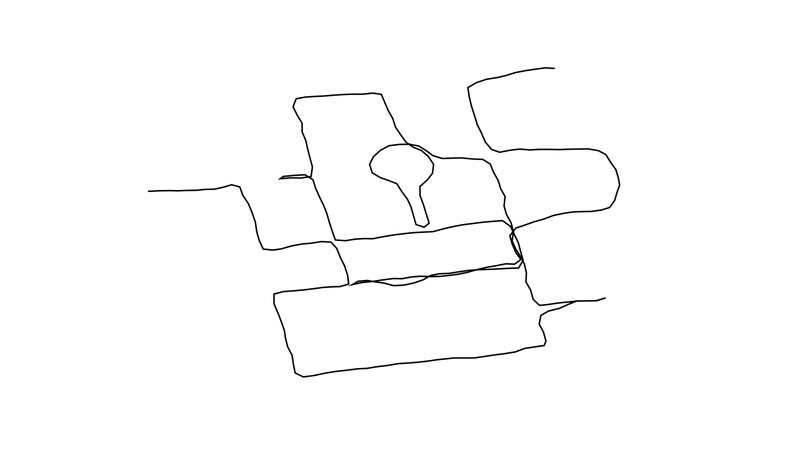

  
#Schillerkiez GPS Pattern 
##Eingabe/Ausgabe, bei Prof. Hoinkis, WS 2013/2014 FH Potsdam

GPS Drawing nach folgender Anweisung:

Begib dich in den Neuköllner Schillerkiez. 

Flaniere frei durch die Straßen. 

Die Herrmannstraße, Mahlowerstraße, Oderstraße und Leinestraße sind deine Grenzen. Du darfst dich auf den Grenzen bewegen aber nicht darüber hinaus gehen. 

Deine Wegwahl ist innerhalb dieser Grenzen frei. Du darfst auch mittendrin stoppen und zurück gehen. 

Außer in den besagten Grenzen zu bleiben, gibt es die Bedingung, einmal den Herrfurthplatz zu umkreisen. 

##[David Röttger](https://github.com/davidroettger)  