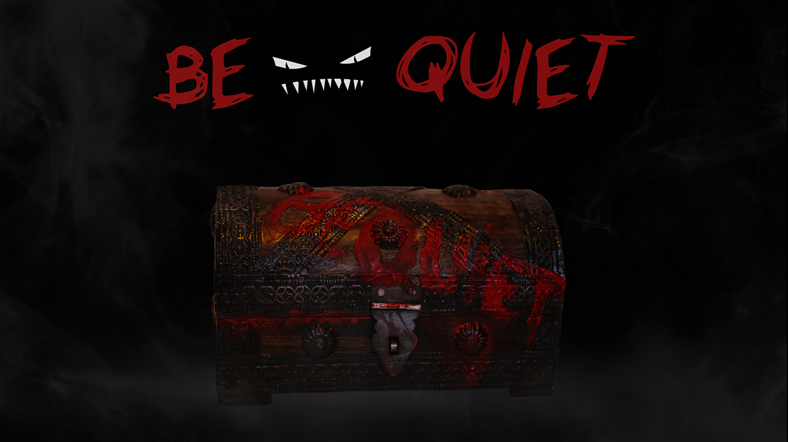

  

#TITLE
BE QUIET
– Kurs: Eingabe/Ausgabe, Prof. Monika Hoinkis und Fabian Morón Zirfas

##DESCRIPTION
Diese IO-Apparatur hat den Zweck ungewünschte Störenfriede in Umgebungen wie z.B. Bibliotheken fern zu halten.
Die bedrohliche Aufmachung der Kiste soll suggerieren das sich im Inneren eine gefährliche Kreatur verbirgt. Über ein Mikrofon fängt die Apparatur die Geräusche in ihrer Umgebung auf. Das Programm registriert wie laut und wie häufig der Lärm in der Umgebung auftritt und setzt sich am einem bestimmten Schwellwert in Bewegung. Durch einen Motor mit Ungleichgewicht wird die Kiste zum Rütteln und Wackeln gebracht und erweckt den Eindruck lebendig zu sein. Um diesen Effekt zu verstärken werden außerdem noch rote LED's angesteuert die an den Schlitzen der Kiste positioniert sind und zum Blinken gebracht werden.

##AUTHOR  
Hello my name is [ebird-design](https://github.com/ebird-design) and I'd like to say... 

##LICENSE  
	This program is free software: you can redistribute it and/or modify it under the terms of the GNU General Public License as published by the Free Software Foundation, either version 3 of the License, or (at your option) any later version.

    This program is distributed in the hope that it will be useful, but WITHOUT ANY WARRANTY; without even the implied warranty of MERCHANTABILITY or FITNESS FOR A PARTICULAR PURPOSE.  See the GNU General Public License for more details.

    You should have received a copy of the GNU General Public License along with this program.  If not, see <http://www.gnu.org/licenses/