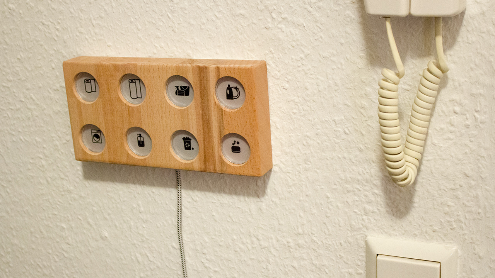
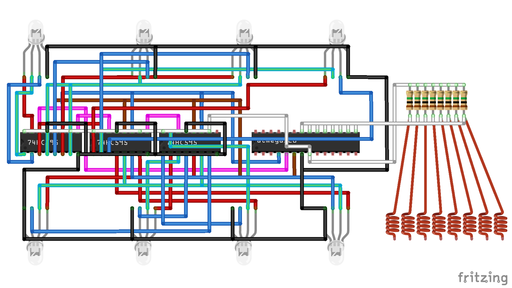

  
#TITLE  
Einkaufszettel
##DESCRIPTION 
a interactive living community shopping list made using arduino. It can indicate the need to buy for 8 household items. The indicator gets activated by touching the icon. With a longer touch you can change the color of the indicator for several room mates. 
##CIRCUIT  
  
##AUTHOR  
[jonij](https://github.com/jonij)
##LICENSE
CC  
