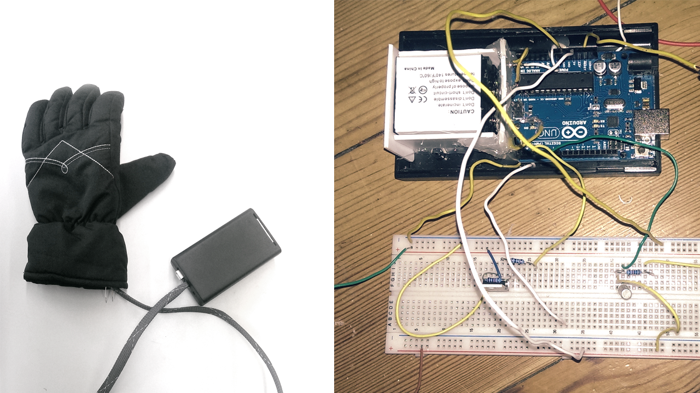

  
  
#IO | Hand Heater

#####Smart Gloves

Der entwickelte Handschuh wärmt im Winter die Hände aktiv auf. Durch ein Schütteln der Hand wird ein Heizdraht, der im Handschuh eingewebt ist, per Akku warm. Der Prototyp des Handschuhs benötigt eine seperate kabelgebundenes Box, die zwei aufladbare Lithium-Ionen Akkus und einen Arduino Uno beinhaltet. Der Handschuh selbst wird neben dem Heizdraht durch einen Lagesensor erweitert, der das aktivieren des Handschuhs freihändig ermöglicht. Diese Funktionsweise ist angelehnt an das Prinzip, durch Bewegung (hier das kurze Schütteln) Wärme zu erzeugen.

---

#####PROBLEME
Hohe Akkukapazität von Nöten
Geeignete Akkus sehr teuer
Heizdraht lässt sich schwer im Handschuh verlegen 
Platzmangel verlangt Box mit Arduino + Akkus Akkus müssen entnehmbar sein

#####LÖSUNGEN
Kompromiss: 2 Lithium-Ionen Akkus 
Heizdraht verläuft in Schlingen
Bau einer eigenen Akku Box

---

#####Aussichten

Ein Ziel sollte die Vermeidung der zusätzlichen Box sein, da diese den Tragekomfort einschränkt.
Durch den erheblichen Strombedarf bei tiefen Temperaturen sind leistungsstärkere Akkus erforderlich.

---

#####FH Potsdam, WS 2013/2014 

Autor: [Sebastian Wloch](https://github.com/lightwaveez)

Entstanden im Kurs [Eingabe, Ausgabe. Grundlagen der prozessorientierten Gestaltung](https://incom.org/workspace/4693)

bei Prof. Monika Hoinkis & Fabian Morón Zirfas

---

#####MIT License

Copyright (c) 2013 Sebastian Wloch

Permission is hereby granted, free of charge, to any person obtaining a copy of this software and associated documentation files (the "Software"), to deal in the Software without restriction, including without limitation the rights to use, copy, modify, merge, publish, distribute, sublicense, and/or sell copies of the Software, and to permit persons to whom the Software is furnished to do so, subject to the following conditions:

The above copyright notice and this permission notice shall be included in all copies or substantial portions of the Software.

THE SOFTWARE IS PROVIDED "AS IS", WITHOUT WARRANTY OF ANY KIND, EXPRESS OR IMPLIED, INCLUDING BUT NOT LIMITED TO THE WARRANTIES OF MERCHANTABILITY, FITNESS FOR A PARTICULAR PURPOSE AND NONINFRINGEMENT. IN NO EVENT SHALL THE AUTHORS OR COPYRIGHT HOLDERS BE LIABLE FOR ANY CLAIM, DAMAGES OR OTHER LIABILITY, WHETHER IN AN ACTION OF CONTRACT, TORT OR OTHERWISE, ARISING FROM, OUT OF OR IN CONNECTION WITH THE SOFTWARE OR THE USE OR OTHER DEALINGS IN THE SOFTWARE.