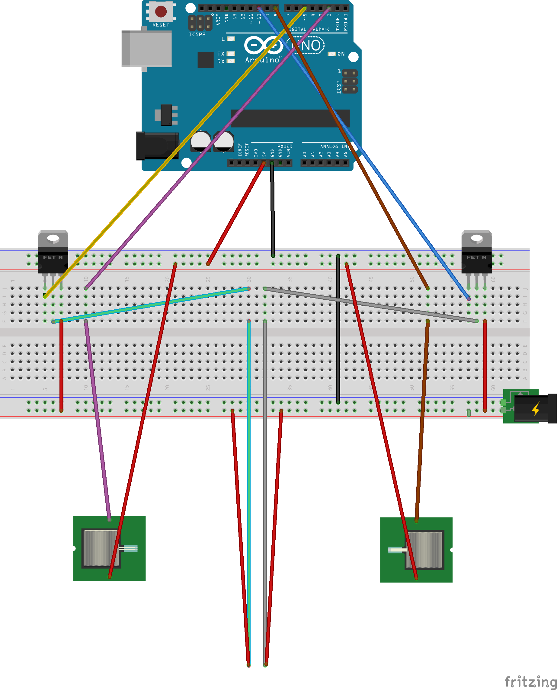

  
  
#TITLE  
Handpong
##DESCRIPTION  
Die Aufgabe umfasste es, eine bestimmte Eingabe direkt in eine Ausgabe zu überführen. Dazu sollte die Ardunio-Plattform verwendet werden.  
Ein kapazitiver Sensor misst den Abstand zur Hand. Ist die Hand nah genug am Sensor wird Strom auf ein Musclewire gegeben, das sich in Richtung der Hand an einem Kartonstreifen angeneht wurde. Sensor und Musclewire gibt es jeweils zwei Mal, sodass der Kartonstreifen von Hand zu Hand zugespielt werden kann.  
Das Ganze funktioniert hierbei vollständig berührungs- und geräuschlos.
##AUTHOR  
Hello my name is [tilokrueger](https://github.com/tilokrueger) and I'd like to say... 
##LICENSE  
