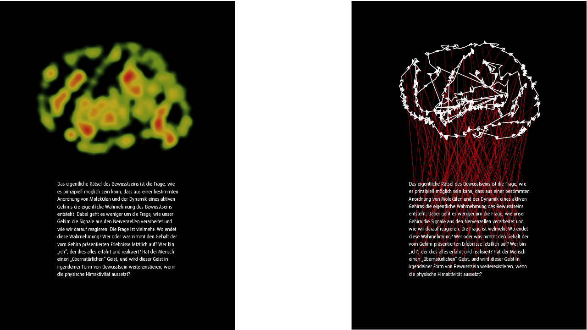

  
#tracked consciousness

Eyetracking Experiment. Entstanden sind zwei Plakate. Auf dem linken Plakat ist eine sogenannte Heatmap, die durch die Aufzeichnung von Augenbewegungen beim Ablesen einer bewusst gewählten Lesevorlage entstanden ist, zu sehen. Die Heatmap ist im Tobii-Eytracking-Programm erzeugt worden. 

Für das rechte Plakat wurden die aufgezeichneten Daten in Processing eingelesen. Der Processing Sketch hat einen Vektor-Pfad ausgegeben welcher als Gestaltungselement dient.

---

#####FH Potsdam, WS 2013/2014 

Autor: David Röttger

Entstanden im Kurs [Eingabe, Ausgabe. Grundlagen der prozessorientierten Gestaltung](https://incom.org/workspace/4693)

bei Prof. Monika Hoinkis & Fabian Morón Zirfas

---

#####MIT License

Copyright (c) 2013 David Roettger

Permission is hereby granted, free of charge, to any person obtaining a copy of this software and associated documentation files (the "Software"), to deal in the Software without restriction, including without limitation the rights to use, copy, modify, merge, publish, distribute, sublicense, and/or sell copies of the Software, and to permit persons to whom the Software is furnished to do so, subject to the following conditions:

The above copyright notice and this permission notice shall be included in all copies or substantial portions of the Software.

THE SOFTWARE IS PROVIDED "AS IS", WITHOUT WARRANTY OF ANY KIND, EXPRESS OR IMPLIED, INCLUDING BUT NOT LIMITED TO THE WARRANTIES OF MERCHANTABILITY, FITNESS FOR A PARTICULAR PURPOSE AND NONINFRINGEMENT. IN NO EVENT SHALL THE AUTHORS OR COPYRIGHT HOLDERS BE LIABLE FOR ANY CLAIM, DAMAGES OR OTHER LIABILITY, WHETHER IN AN ACTION OF CONTRACT, TORT OR OTHERWISE, ARISING FROM, OUT OF OR IN CONNECTION WITH THE SOFTWARE OR THE USE OR OTHER DEALINGS IN THE SOFTWARE.

