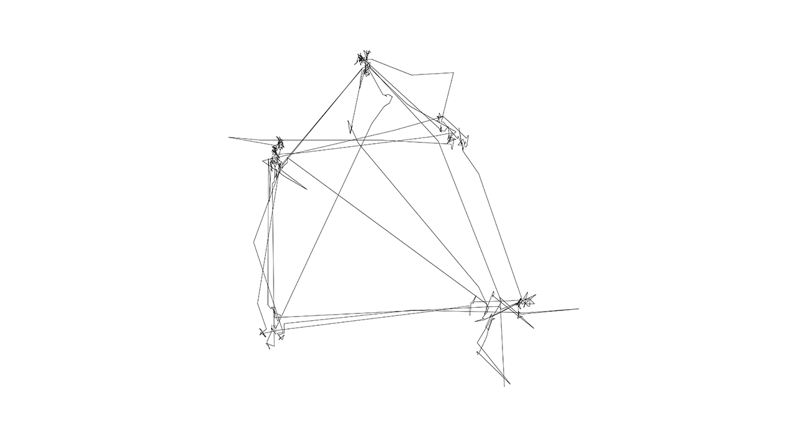

  
#Bildmaschine  
##Visualisation of eyetracking paths  
**Jens Rauenbusch**, with the help of the participants Martin Lexow and Paul Lehmann  

----------
@jensra  
Potsdam, DE/GER

*Kurs: Eingabe/Ausgabe (Basics), Prof. Hoinkis, FH Potsdam*

This sketch visualised the eyetracking data collected by the Tobii Eyetracking system.  
First part: Poem "Melusine" by Loriot, displayed in different layouts.  
Second part: "Das ist das Haus vom Nikolaus".  
  
The eyetracker's data (.txt, separated by tabs) can be found in the folder "csvfiles" within the Processing sketch folder.

-------

Special thanks to @fabiantheblind (Fabian Morón Zirfas), FH Potsdam

    Copyright (C) 2014  Jens Rauenbusch

	This program is free software: you can redistribute it and/or modify it under the terms of the GNU General Public License as published by the Free Software Foundation, either version 3 of the License, or (at your option) any later version.

    This program is distributed in the hope that it will be useful, but WITHOUT ANY WARRANTY; without even the implied warranty of MERCHANTABILITY or FITNESS FOR A PARTICULAR PURPOSE.  See the GNU General Public License for more details.

    You should have received a copy of the GNU General Public License along with this program.  If not, see <http://www.gnu.org/licenses/