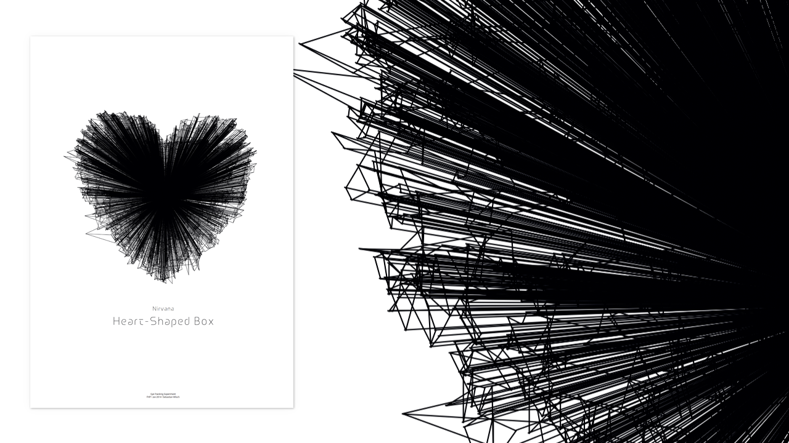

  
#Eyetracking Experiment

#####It's Heart-shaped!

Das oben gezeigte Plakat ist Ergebniss von Eyetracking und eine Visualisierung zu Nirvana's "Heart-Shaped Box". Die Testperson hat während der Song abgespielt wurde den Songtext gelesen, der in Form gebracht worden ist. Da die Augen während dem Lesen nicht wie erwartet in einer kontinuirliche Bewegung über den Text fliegen, sondern ruckartig von Wort zu Wort springen, ist ein Zig-zag Muster entstanden. Mittels Processing wurden die gemessenen Daten visualisiert. Neben den Bewegungspfaden wurde jeder gemessene Punkt per Linie mit dem Mittelpunkt der Grafik verbunden und so ein zentralisiertes Muster geschaffen.

---

#####FH Potsdam, WS 2013/2014 

Autor: [Sebastian Wloch](https://github.com/lightwaveez)

Entstanden im Kurs [Eingabe, Ausgabe. Grundlagen der prozessorientierten Gestaltung](https://incom.org/workspace/4693)

bei Prof. Monika Hoinkis & Fabian Morón Zirfas

---

#####MIT License

Copyright (c) 2013 Sebastian Wloch

Permission is hereby granted, free of charge, to any person obtaining a copy of this software and associated documentation files (the "Software"), to deal in the Software without restriction, including without limitation the rights to use, copy, modify, merge, publish, distribute, sublicense, and/or sell copies of the Software, and to permit persons to whom the Software is furnished to do so, subject to the following conditions:

The above copyright notice and this permission notice shall be included in all copies or substantial portions of the Software.

THE SOFTWARE IS PROVIDED "AS IS", WITHOUT WARRANTY OF ANY KIND, EXPRESS OR IMPLIED, INCLUDING BUT NOT LIMITED TO THE WARRANTIES OF MERCHANTABILITY, FITNESS FOR A PARTICULAR PURPOSE AND NONINFRINGEMENT. IN NO EVENT SHALL THE AUTHORS OR COPYRIGHT HOLDERS BE LIABLE FOR ANY CLAIM, DAMAGES OR OTHER LIABILITY, WHETHER IN AN ACTION OF CONTRACT, TORT OR OTHERWISE, ARISING FROM, OUT OF OR IN CONNECTION WITH THE SOFTWARE OR THE USE OR OTHER DEALINGS IN THE SOFTWARE.