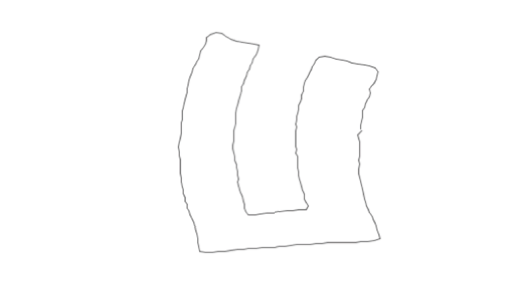

  
#TITLE
GPS-WALK – HUFEISEN
– Kurs: Eingabe/Ausgabe, Prof. Monika Hoinkis und Fabian Morón Zirfas
– Wintersemester 13/14

##DESCRIPTION
Verfasse eine Wegbeschreibung und lasse diese von einem Kommilitonen ablaufen. Der Weg soll über GPS getracked werden und später eine möglichst interessante Form ergeben.

##EXECUTION
Die Aufgabe wurde jeweils in Zweierteams bearbeitet. Paul Lehmann lief einen von mir erdachten Weg ab und ich lief im Gegenzug einen Kurs nach seinen Vorgaben.
Es folgt der Kurs den ich mir für Paul ausgedacht habe. Die Infrastruktur der Straßen in seiner Gegend boten es an ihn einen Kurs in der Form eines Hufeisen lassen zu lassen.
–– Start ist „Sondershauser Straße 107A in Berlin“.
Gehe Richtung „Lichterfelder Ring“ und biege dann rechts auf „Lichterfelder Ring“ ab. Biege
rechts in die „Stanzer Zeile“ ab.
Biege rechts auf die „Hilburghauser Straße“ ab. Biege dann rechts in den „Pertisauer Weg“
ab. Biege links in den „Heiterwanger Weg“ ab.
Biege links in den „Fügener Weg“ ab. Biege rechts auf die „Hilburghauser Straße“ ab. Biege
rechts in die „Sondershauser Straße ab. Ziel ist die „Sondershauser Straße 107A“.––

##AUTHOR  
Tim Ebert
FH-Potsdam
1. Semester Interface Design
[ebird-design]

##LICENSE  
	This program is free software: you can redistribute it and/or modify it under the terms of the GNU General Public License as published by the Free Software Foundation, either version 3 of the License, or (at your option) any later version.

    This program is distributed in the hope that it will be useful, but WITHOUT ANY WARRANTY; without even the implied warranty of MERCHANTABILITY or FITNESS FOR A PARTICULAR PURPOSE.  See the GNU General Public License for more details.

    You should have received a copy of the GNU General Public License along with this program.  If not, see <http://www.gnu.org/licenses/