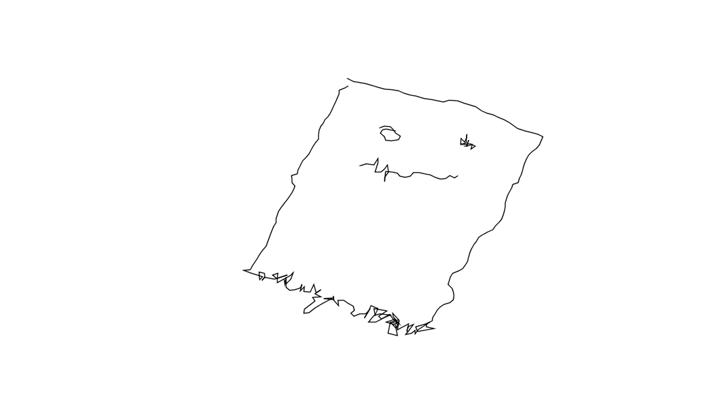

  
#GHOST  

##[AUTHOR](https://github.com/nushin)  

Nushin Yazdani 
Berlin, DE/GER

Kurs: Eingabe/Ausgabe (Basics), Prof. Monika Hoinkis/Fabian Morón Zirfas, FH Potsdam

##DESCRIPTION  

Bildspaziergang

Sprache: Deutsch
Dieses Programm visualisiert die GPS-Daten aus der App "Runkeeper". Die GPS-Daten liegen im Ordner "data".

Aufgabenbeschreibung:
Findet euch in 2er Teams zusammen.
Schreibt fuer euren Partner eine Weganweisung fuer eine GPS Zeichnung.
Es kann ein Muster oder ein konkretes Bild sein.
Nutzt Kartenmaterial als Planungsgrundlage
Teilt eurem Partner nicht mit was das Motiv ist, er ist ein blind operator
Tauscht die Anweisungen aus und erlauft jeweils das Bild/die Weganweisung mit einem GPS faehigen Geraet.
Visualisierung in processing

##LICENSE: MIT 

