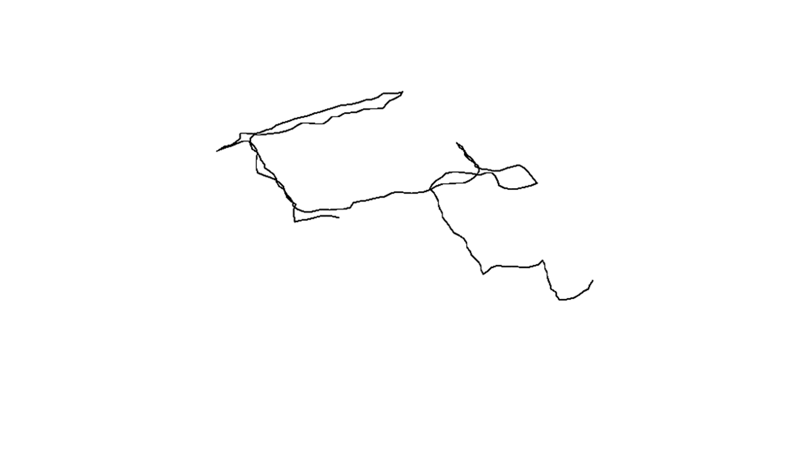

  
#TITLE 
Bildspaziergang
 
##DESCRIPTION  
Bei diesem Projekt sollte ein GPS-Datensatz visualisiert werden, der durch eine Spaziergangsanleitung erstellt worden war.
Dabei wurde Processing verwendet, um den abgelaufenen Weg nachzuverfolgen.

Anleitung_:
Stell dich mit dem Rücken zu deiner Haustür und halte eine Münze bereit.
Wirf die Münze: bei Zahl gehe links // bei Kopf gehe rechts.

Gelangst du an eine Ampelkreuzung: bei grün gehe geradeaus // bei rot wirf die Münze.
Gelangst du an eine Kreuzung ohne Ampel: bleib stehen und wirf die Münze – bei Zahl gehe links // bei Kopf gehe rechts.

Siehst du einen Passanten mit Kinderwagen drehe dich sofort um 180° und setze deinen Weg fort.

Lauf so weit bis du die Münze 15 mal geworfen hast.

##[AUTHOR](https://github.com/tilokrueger)  
Hello my name is [tilokrueger](https://github.com/tilokrueger) and I'd like to say... 
##LICENSE  
