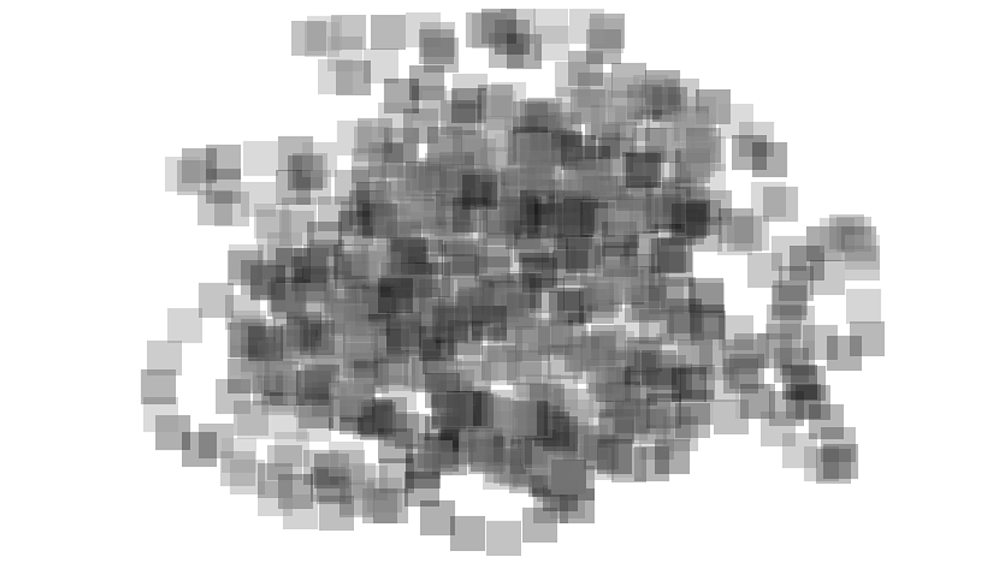

  
__Jens Rauenbusch, November 2013__  
@jensra  
Potsdam, DE/GER

*Kurs: Eingabe/Ausgabe (Basics), Prof. Hoinkis, FH Potsdam*
*und Fabian Morón Zirfas*

Sprache: Deutsch

----

Multitouch Experiments
===

  

FUNKTIONSBESCHREIBUNG
---
In diesem Programm wurde der TUIO-Demosketch verändert, um die Funktion eines Multitouch-Eingabegerätes auszutesten. Das Programm erzeugt eine Leinwand, auf die mit den Fingern Rechtecke gezeichnet werden können. Diese Rechtecke sind in unterschiedlichen Graustufen und leichter Transparenz und lassen so vor allem melancholische Bilder zu.

HINWEIS
---
Dieser Sketch sollte mit Processing 1.5 geöffnet werden.
Um die Multitouch-Eingabe zu nutzen, kann auf einem Apple-Laptop die App "Tongseng" gestartet werden. Weitere Hinweise dazu im Code.

ANMERKUNGEN ZUM CODE
---
Zum Teil sind Bestandteile des Codes auskommentiert, die zu Testzwecken
dennoch im Code verbleiben sollen.

Dieser Code ist ausdrücklich zur Weiterverwendung durch andere gedacht.

    Copyright (C) 2014  Jens Rauenbusch

	This program is free software: you can redistribute it and/or modify it under the terms of the GNU General Public License as published by the Free Software Foundation, either version 3 of the License, or (at your option) any later version.

    This program is distributed in the hope that it will be useful, but WITHOUT ANY WARRANTY; without even the implied warranty of MERCHANTABILITY or FITNESS FOR A PARTICULAR PURPOSE.  See the GNU General Public License for more details.

    You should have received a copy of the GNU General Public License along with this program.  If not, see <http://www.gnu.org/licenses/