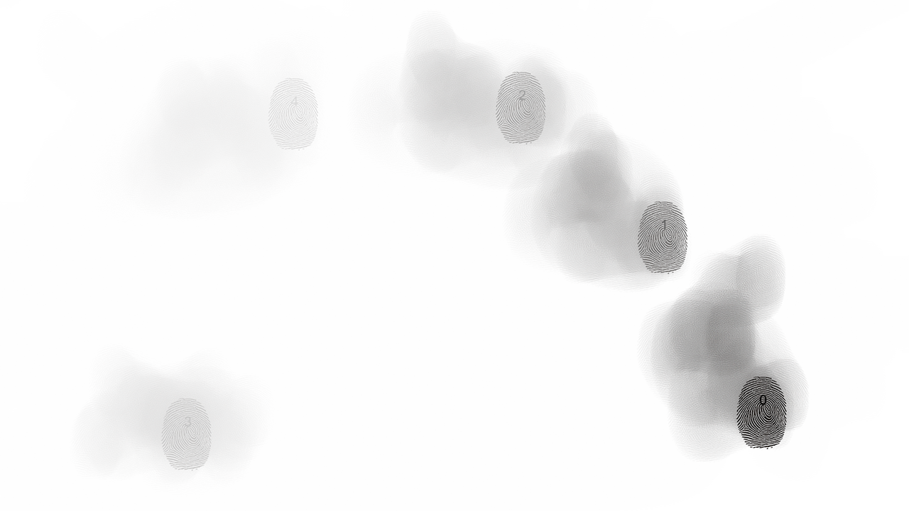

  
#Multitouch Test Application

##### Beschreibung
Mit Hilfe von Processing und der TUIO Library wurde die Interaktion mittels Multitouch getestet. 
Mein Ziel war es eine möglichst direkte Verbindung von Berührung per Finger und Effekt zu schaffen. Daher zeigt der Screen bei Berührung bei jedem Finger einen Fingerabdruck an, der bei wischen des Finger nicht gänzlich verschwindet. Der Finger wird praktisch selbst zum Werkzeug.

---

#####FH Potsdam, WS 2013/2014 

Autor: [Sebastian Wloch](https://github.com/lightwaveez)

Entstanden im Kurs [Eingabe, Ausgabe. Grundlagen der prozessorientierten Gestaltung](https://incom.org/workspace/4693)

bei Prof. Monika Hoinkis & Fabian Morón Zirfas

---

#####MIT License

Copyright (c) 2013 Sebastian Wloch

Permission is hereby granted, free of charge, to any person obtaining a copy of this software and associated documentation files (the "Software"), to deal in the Software without restriction, including without limitation the rights to use, copy, modify, merge, publish, distribute, sublicense, and/or sell copies of the Software, and to permit persons to whom the Software is furnished to do so, subject to the following conditions:

The above copyright notice and this permission notice shall be included in all copies or substantial portions of the Software.

THE SOFTWARE IS PROVIDED "AS IS", WITHOUT WARRANTY OF ANY KIND, EXPRESS OR IMPLIED, INCLUDING BUT NOT LIMITED TO THE WARRANTIES OF MERCHANTABILITY, FITNESS FOR A PARTICULAR PURPOSE AND NONINFRINGEMENT. IN NO EVENT SHALL THE AUTHORS OR COPYRIGHT HOLDERS BE LIABLE FOR ANY CLAIM, DAMAGES OR OTHER LIABILITY, WHETHER IN AN ACTION OF CONTRACT, TORT OR OTHERWISE, ARISING FROM, OUT OF OR IN CONNECTION WITH THE SOFTWARE OR THE USE OR OTHER DEALINGS IN THE SOFTWARE.