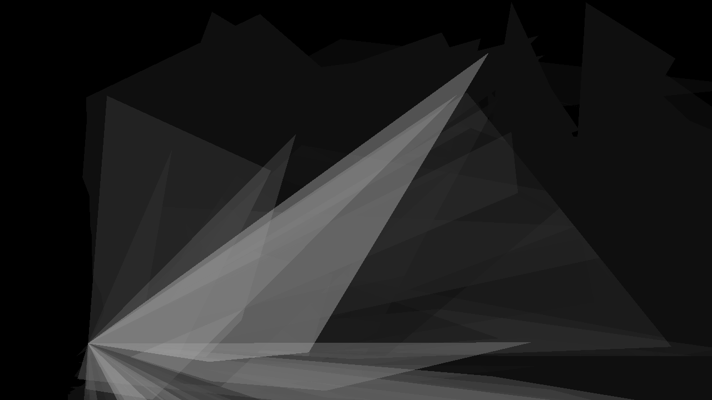

  
#TITLE  
MultiTouch-Fragments
##DESCRIPTION 
Draws rectangles with two acute and two obstuse angles while touching.
##AUTHOR  
[martinlexow](https://github.com/martinlexow)
##LICENSE
open source
