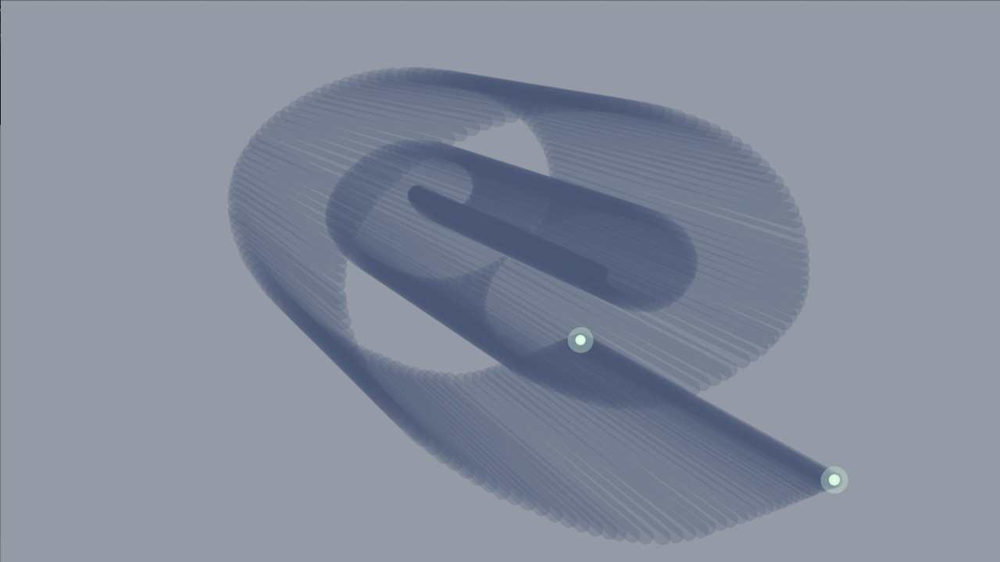

  
#TITLE 
3fakeD
 
##DESCRIPTION  
Bei diesem Projekt wird durch eine Multitoucheingabe eine geschummelte Dreidimensionalität dargestellt, indem die gezeichneten Geraden auf einen festgelegten Punkt fluchten.

##AUTHOR  
Hello my name is [tilokrueger](https://github.com/tilokrueger) and I'd like to say... 
##LICENSE  
