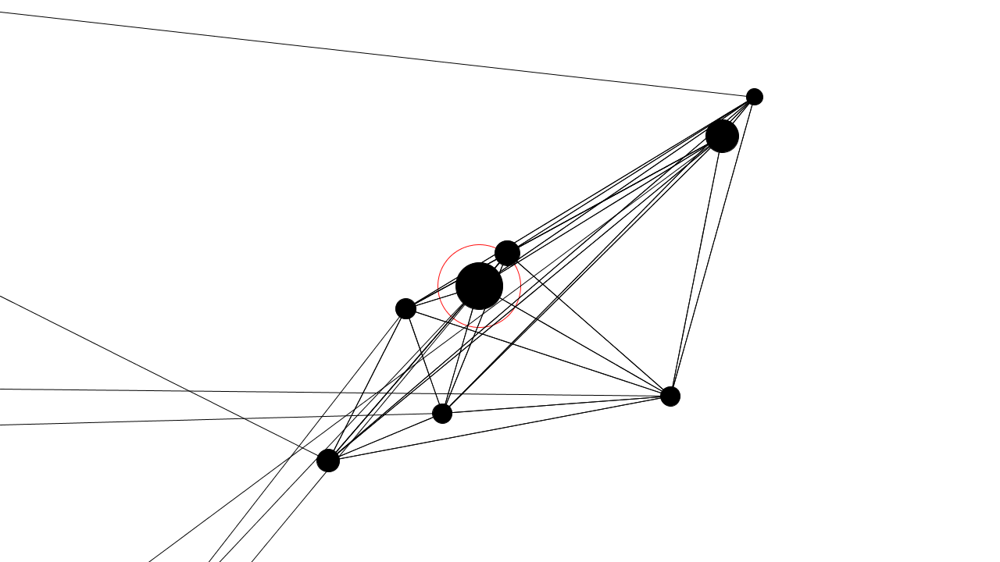

  
#Random linked cirkles
Processing Umsetzung folgender analogen Anweisung:

Zeichne (freihand mit schwarzem Marker) mindestens 6 und maximal 10 Kreise mit einem Durchmesser von mindestens 2cm und maximal 5cm, kreuz und quer verteilt auf ein horizontal liegendes DIN A4 Blatt. Fülle diese Kreise schwarz (schwarzer Marker). Ein Kreis soll, am Ende, als der Größte erkennbar sein.

Umrande (freihand) den größten Kreis mit einem roten Marker. Die Umrandung soll einen Abstand, mindestens 1cm, zum Kreis haben. 

Nun verbinde alle Kreismittelpunkte untereinander mit schwarzen Geraden (schwarzer Marker) und mit Hilfe eines Lineals.

Lasse außerdem von jedem Kreismittelpunkt eine schwarze Gerade nach außen ins Leere treffen (Lineal & schwarzer Market). Die Geraden sollen den Blattrand erreichen.

---

#####FH Potsdam, WS 2013/2014 

Autor: David Röttger

Entstanden im Kurs [Eingabe, Ausgabe. Grundlagen der prozessorientierten Gestaltung](https://incom.org/workspace/4693)

bei Prof. Monika Hoinkis & Fabian Morón Zirfas

---

#####MIT License

Copyright (c) 2013 David Roettger

Permission is hereby granted, free of charge, to any person obtaining a copy of this software and associated documentation files (the "Software"), to deal in the Software without restriction, including without limitation the rights to use, copy, modify, merge, publish, distribute, sublicense, and/or sell copies of the Software, and to permit persons to whom the Software is furnished to do so, subject to the following conditions:

The above copyright notice and this permission notice shall be included in all copies or substantial portions of the Software.

THE SOFTWARE IS PROVIDED "AS IS", WITHOUT WARRANTY OF ANY KIND, EXPRESS OR IMPLIED, INCLUDING BUT NOT LIMITED TO THE WARRANTIES OF MERCHANTABILITY, FITNESS FOR A PARTICULAR PURPOSE AND NONINFRINGEMENT. IN NO EVENT SHALL THE AUTHORS OR COPYRIGHT HOLDERS BE LIABLE FOR ANY CLAIM, DAMAGES OR OTHER LIABILITY, WHETHER IN AN ACTION OF CONTRACT, TORT OR OTHERWISE, ARISING FROM, OUT OF OR IN CONNECTION WITH THE SOFTWARE OR THE USE OR OTHER DEALINGS IN THE SOFTWARE.

