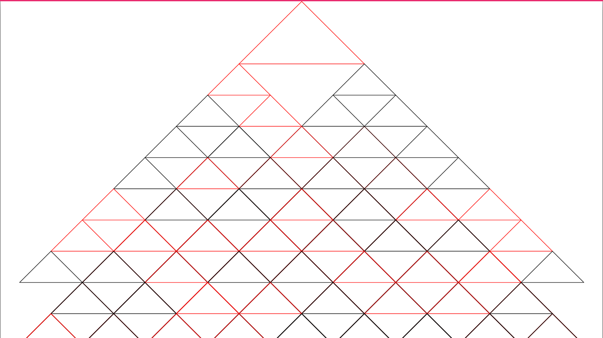

  
#TITLE
INFINITE TRIANGLES
– Kurs: Eingabe/Ausgabe, Prof. Monika Hoinkis und Fabian Morón Zirfas

##DESCRIPTION
Ziel der Übung war es die Zeichenanweisungen, die wir vorher an menschliche Testpersonen gerichtet hatten, nun mit Hilfe von Processing von einem Computerprogamm ausführen zu lassen.

##ANWEISUNG
Zeichne mit einem roten Stift ein Dreieck in die Mitte des Blattes. Jetzt zeichne mit einem schwarzen Stift an jeder Ecke des roten Dreiecks ein anliegendes schwarzes Dreieck. Zeichne immer weiter Dreiecke, in rot und/oder schwarz, an alle freien Eckpunkte der entstehenden Dreiecke bis das Blatt zumindest halb voll ist. Die Dreiecke dürfen sich dabei nicht überlappen.

##ANPASSUNGEN
Einige der Anweisungen, die für Menschen recht einfach umzusetzen sind, erwiesen sich als hochkomplex in der Programmierung. Um den Zeitplan einzuhalten wurden darum einige Kleinigkeiten angepasst.

– Das erste Dreieck wird in der Mitte am oberen Rand der Zeichenfläche gezeichnet. (Ursprünglich Mitte Mitte)
– Die Dreiecke drüfen sich überschneiden. (Dies was nötig um eine zeitaufwändige Kollisionsabfrage zu vermeiden)

##AUTHOR  
Hello my name is [ebird-design](https://github.com/ebird-design) and I'd like to say... 

##LICENSE  
	This program is free software: you can redistribute it and/or modify it under the terms of the GNU General Public License as published by the Free Software Foundation, either version 3 of the License, or (at your option) any later version.

    This program is distributed in the hope that it will be useful, but WITHOUT ANY WARRANTY; without even the implied warranty of MERCHANTABILITY or FITNESS FOR A PARTICULAR PURPOSE.  See the GNU General Public License for more details.

    You should have received a copy of the GNU General Public License along with this program.  If not, see <http://www.gnu.org/licenses/