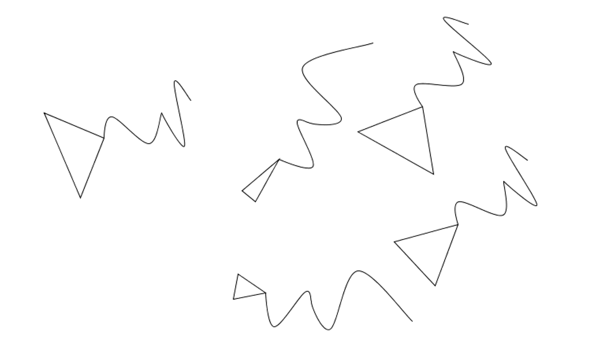

  
__Jens Rauenbusch, November 2013__  
@jensra  
Potsdam, DE/GER

*Kurs: Eingabe/Ausgabe (Basics), Prof. Hoinkis, FH Potsdam*

Sprache: Deutsch

----

Umsetzung Muster (Konzeptkunst), Version 3.0
===

  

FUNKTIONSBESCHREIBUNG
---
Dieses Programm erzeugt eine zufällige Anzahl von Dreiecken, die auf der Zeichenfläche
verteilt und zufällig ausgerichtet sind. Von den "Spitzen" der Dreiecke verläuft jeweils eine
Linie in Kurven.

HINWEIS
---
Die zugrunde liegende Regel für das Muster sieht vor, dass sich weder die Dreiecke noch die
Linien schneiden und dass weder Dreiecke noch Linien den Rand der Zeichenfläche berühren.
Die Umsetzung dieser Vorgabe würde ein Raster erfordern, das die Positionen der Dreiecke erfasst
und keine anderen Dreiecke an der gleichen Position zulässt.
Ein solches Raster würde den Programmieraufwand exorbitant steigern, aus diesem Grund wird auf
die Umsetzung dieser Vorgabe verzichtet.

ANMERKUNGEN ZUM CODE
---
Zum Teil sind Bestandteile des Codes auskommentiert, die zu Testzwecken
dennoch im Code verbleiben sollen.

Dieser Code ist ausdrücklich zur Weiterverwendung durch andere gedacht.

DANKSAGUNG
---
Danke an @fabiantheblind (Fabian Morón Zirfas), FH Potsdam

    Copyright (C) 2014  Jens Rauenbusch

	This program is free software: you can redistribute it and/or modify it under the terms of the GNU General Public License as published by the Free Software Foundation, either version 3 of the License, or (at your option) any later version.

    This program is distributed in the hope that it will be useful, but WITHOUT ANY WARRANTY; without even the implied warranty of MERCHANTABILITY or FITNESS FOR A PARTICULAR PURPOSE.  See the GNU General Public License for more details.

    You should have received a copy of the GNU General Public License along with this program.  If not, see <http://www.gnu.org/licenses/