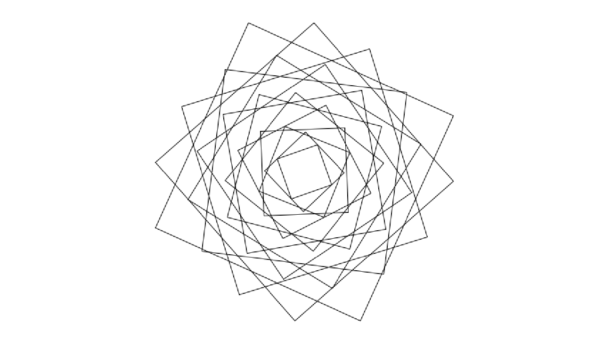

  
#Digitalization
##patternprocedure from analog to digital
-----

It deals with a digital process or digitalization, which I've written an analog prodedure and i should try to digitalize this prodedure for processing that understand Java-Language, only.

-----

Kurs: Eingabe/Ausgabe (Basics), Prof. Hoinkis, FH Potsdam
Weiterverwenden ist erlaubt!

Vielen Dank, Fabian!!!

-----
##License  

    Copyright (C) 2014  Thomas Miebach

	This program is free software: you can redistribute it and/or modify it under the terms of the GNU General Public License as published by the Free Software Foundation, either version 3 of the License, or (at your option) any later version.

    This program is distributed in the hope that it will be useful, but WITHOUT ANY WARRANTY; without even the implied warranty of MERCHANTABILITY or FITNESS FOR A PARTICULAR PURPOSE.  See the GNU General Public License for more details.

    You should have received a copy of the GNU General Public License along with this program.  If not, see <http://www.gnu.org/licenses/