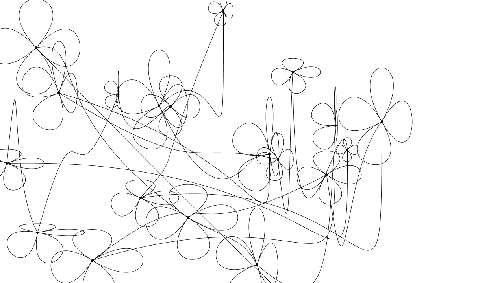

  
#Umsetzung der Anweisung
##Eingabe/Ausgabe::Prof.Hokins::WS 2013/2014 FH Potsdam
##Jinwook Yun
##
Umsetzung einer Anweisung mit processing

Setze eine Punkt, die Größe etwa 2mm ist.
Zeichne 4Kurven aus dem Punkt bis da hin.
Zeichne fünfte Kurve daraus irgendwo anders hin und setze noch einen gleichen neuen Punkt.
Wiederhole darüber, bis das Blatt ausfüllt wird.

Hinweis : Während der Ausfüllung den Kuli nicht abziehen.
##LICENSE  
